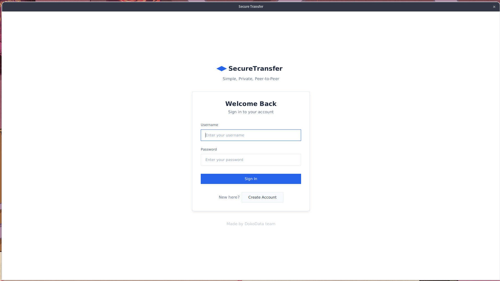
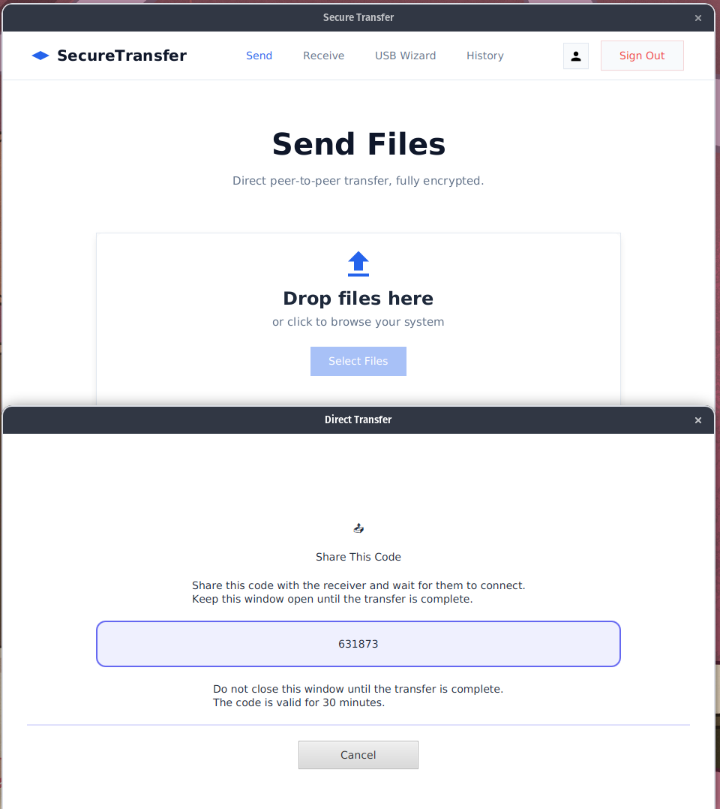
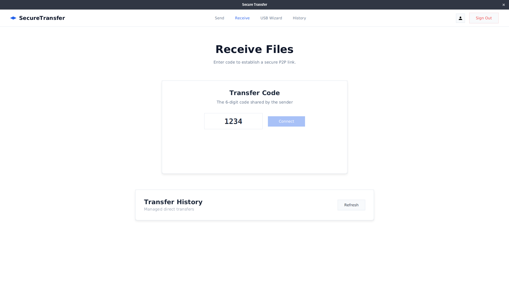

# SecureTransfer VIII

SecureTransfer VIII is a high-performance, peer-to-peer desktop application designed for encrypted file transfers. Built with JavaFX and Spring Boot, it prioritizes security, speed, and a minimalist user experience.

## Core Logic & Architecture

### 1. Encryption Algorithm
The application employs a multi-layered security model to ensure data confidentiality and integrity during transit and at rest.

- **Asymmetric Layer (Handshake)**: RSA-4096 (OAEP with SHA-256 padding) is used for the initial security handshake. It allows the Sender and Receiver to exchange symmetric keys without exposing them to the relay server.
- **Symmetric Layer (Data)**: AES-256 in CBC (Cipher Block Chaining) mode with PKCS5 padding is used for binary file encryption.
- **Key Wrapping**: The AES session key and Initialization Vector (IV) are wrapped using the Receiver's RSA public key.
- **Password Security**: User credentials are protected using BCrypt hashing with a high cost factor.
- **Integrity**: Every transfer is verified using SHA-256 checksums to detect any data corruption or tampering.

### 2. Sending Algorithm (Protocol)
The transfer protocol is optimized for low-latency streaming and minimal memory footprint.

- **Signaling**: WebSockets (JSR-356) through a coordination server handle the session establishment and discovery.
- **Discovery**: Peers exchange local and public connection details (IP/Port) via the relay.
- **Streaming Flow**:
    1. **Bufferization**: Files are processed in 8KB chunks.
    2. **On-the-fly Encryption**: Each chunk is encrypted using the session AES key.
    3. **Binary Streaming**: The encrypted chunks are streamed directly over the WebSocket connection.
    4. **Synchronous Write**: The Receiver decrypts chunks in real-time and writes them to disk to avoid buffering entire files in RAM.

## Build and Run Instructions

### Prerequisites
- JDK 21+ (OpenJDK recommended)
- Maven 3.8+
- Port 8446 (Default for WebSocket signaling)

### Local Build
```bash
# Clean previous builds and install dependencies
mvn clean install

# Launch the Application
mvn javafx:run
```

### Troubleshooting Database Lock
If the H2 database is locked (`Database may be already in use`), terminate any lingering Java processes:
```bash
fuser -k data/securetransfer.mv.db
```

## Docker Setup
The application can be containerized for relay/testing environments using the provided `docker-compose`.

```bash
# Build and start services
docker-compose up --build -d

# View logs
docker-compose logs -f
```

## UI Showcase
Below are the outputs illustrating the "Minimalist Zen" aesthetic.

| Screen | Description |
| :--- | :--- |
|  | Secure Gateway |
|  | Encryption & Transmission |
|  | Retrieval & Decryption |

# Authors
- Pradip Dhungana
- Vision Rijal  
- Priyanka Patel